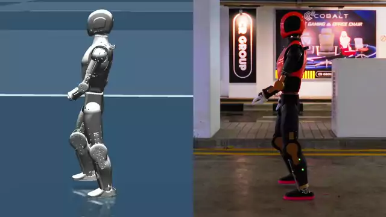

# Cyclotron

<p align="center">
  
</p>

Asimov 1 is an open-source humanoid robot developed by
[Menlo Research](https://menlo.ai/). This repository provides the
training and evaluation code for its locomotion policies, so you can
train policies in simulation and deploy them to the real robot.

Get your own Asimov 1.
[Order now](https://menlo.ai/order).

This repo is a standalone Isaac Lab extension for training Asimov-1 locomotion policies with
PPO and adversarial motion priors (AMP).

## Quick Install

For a brand-new machine with no existing Isaac Lab setup, run the install
script from the project root. It sets up a uv-managed environment, pulls the
pinned Isaac Lab and `asimov-1` submodules, and installs everything needed
to train and play. Prerequisites: Ubuntu 22.04+ (x86_64), a compatible
NVIDIA driver, [uv](https://docs.astral.sh/uv/) installed, and `sudo` access
(used to install `cmake`/`build-essential`).

```bash
git clone https://github.com/menloresearch/cyclotron.git
cd cyclotron
./quick_install.sh
```

The full install takes a while, since it downloads Isaac Sim, PyTorch, Isaac Lab and the Asimov 1 robot model.

#### Advanced Install

If you already have your own Isaac Lab checkout you want
to reuse, want conda instead of uv, or just want to understand what each
install step does: **[Advanced Install](INSTALL.md)**.

## Train

Before starting a training run, run a quick test to ensure the full pipeline is functional. The following code will fire off a short training run with a small number of environments which should take ~10 minutes on a 4090.

**Quick Test**

This is a small job to see if the full training code is working. These settings should work for most GPUs and finish relatively quickly.

```bash
./cyclotron.sh --train \
    --task Asimov1-Velocity-AMP-v0 --num_envs 128 --headless --max_iterations 100
```

#### Single GPU Training Run

Use this code to replicate the training run for our baseline policy using a single GPU.

**AMP (recommended)**

```bash
./cyclotron.sh --train \
    --task Asimov1-Velocity-AMP-v0 --num_envs 4096 --headless
```

**Plain PPO baseline**

```bash
./cyclotron.sh --train \
    --task Asimov1-Velocity-v0 --num_envs 4096 --headless
```

Useful flags: `--max_iterations <n>`, `--seed <n>`, `--video` (record rollout
clips during training).

Training prints the run directory and a command to resume the run from its
latest checkpoint, at the start and again when training ends or is
interrupted. Resuming starts a new run directory initialised from that checkpoint.

Note: We use 4096 `num_envs` to train our baseline locomotion policy using A6000 or pro 6000. If you hit any out of memory errors, consider lowering the `num_envs`. However, this means that the policy may take longer to converge or may be less stable for the same number of iterations.

#### Multi-GPU Training Run

This code runs training via `--distributed` with two GPUs and 4096 environments per GPU. You should adjust the parameters according to the compute available to you.

```bash
python -m torch.distributed.run --standalone --nnodes=1 --nproc_per_node=2 \
    scripts/rsl_rl/train.py \
    --task Asimov1-Velocity-AMP-v0 --num_envs 4096 --headless --distributed
```

## Play / Evaluate

Load the latest checkpoint and visualize the trained policy:

```bash
./cyclotron.sh --play \
    --task Asimov1-Velocity-AMP-Play-v0 --num_envs 32
```

Use `--checkpoint` to select a specific checkpoint (`--target` is an alias),
or `--onnx-output <path>` for an extra ONNX export. `--checkpoint` works the
same way for `--train`, `--play` and `--share`: pass a full path to a `.pt`
file, or a filename such as `model_500.pt` together with `--load_run <run>`.
Without it, the latest checkpoint is used.

Checkpoints and logs are written to `logs/rsl_rl/<experiment_name>/<run>/`.

## Share your policy

Share a finished run on the Hugging Face Hub. Log in first with
`hf auth login`.

```bash
./cyclotron.sh --share logs/rsl_rl/<experiment_name>/<run> \
    --repo-id <user_or_org>/<repo_name>
```

This uploads `agent.yaml`, `env.yaml`, `policy.onnx` and a generated
`README.md` model card (BSD-3-Clause, `library_name: asimov`,
`pipeline_tag: robotics`). If the run has no `exported/policy.onnx` yet, the
latest checkpoint is exported automatically; use `--checkpoint` to share a
different one (a full path, or a filename inside the run directory). Use `--title "<text>"` to set the card's title,
`--summary "<text>"` to add a paragraph describing your training method,
`--private` to create a private repo, and `--dry-run` to preview the card
without uploading.

## View a shared policy

To watch your own training runs, use `--play`. `--view` is for policies someone
shared on the Hugging Face Hub, which contain only the ONNX policy and its
config. It runs them in your browser with
[humanoid-policy-viewer](https://github.com/menloresearch/humanoid-policy-viewer)
(MuJoCo + onnxruntime in WebAssembly), so it needs only
[Node.js](https://nodejs.org) 20 or newer: no Isaac Sim and no GPU.

```bash
./cyclotron.sh --view <org>/<model>
```

On the first run this fetches the `third_party/humanoid-policy-viewer`
submodule, its npm dependencies and the Asimov 1 robot model. It then
downloads `policy.onnx`, `env.yaml` and `agent.yaml` to
`~/.cache/humanoid-policy-viewer/hf/`, checks them, and opens the viewer with
the policy selected. The gains, action scale, default pose and torque limits
come from `env.yaml`. Use the sliders to command a velocity and push the robot.

Options: `--revision <ref>` (branch, tag or commit), `--port <n>` (default
3000) and `--no-open`. Private or gated repos need `HF_TOKEN` set.

The viewer simulates with MuJoCo, not PhysX, so it doubles as a quick
sim2sim check. It expects the policy interface of this repo's velocity tasks
(78 observations at 50 Hz, 23 actions).

On a remote machine with no display, `--view` prints the URL instead of
opening a browser. The server listens on localhost only, so forward its port
over SSH and open `http://localhost:3000` on your own machine:

```bash
ssh -L 3000:localhost:3000 <remote>
```

## Troubleshooting
The training code has been tested on the following GPUs:
- NVIDIA RTX A6000
- NVIDIA RTX PRO 6000
- NVIDIA RTX 4090
- NVIDIA RTX 3090

## Acknowledgement

This repository is built upon the support and contributions of the following open-source projects. Special thanks to:

- [IsaacLab](https://github.com/isaac-sim/IsaacLab): The foundation for training and running codes.
- [MuJoCo](https://github.com/google-deepmind/mujoco): Providing powerful simulation functionalities.
- [whole_body_tracking](https://github.com/HybridRobotics/whole_body_tracking): Versatile humanoid control framework for motion tracking.
- [beyondAMP](https://github.com/Renforce-Dynamics/beyondAMP): Referenced for AMP-based motion imitation.
- [mjlab](https://github.com/mujocolab/mjlab): MuJoCo-based training utilities and references.
- [humanoid-policy-viewer](https://github.com/Axellwppr/humanoid-policy-viewer): Browser-based MuJoCo policy viewer used by `--view`.

## Community

We're planning community livestreams where we’ll test policies
contributed by developers on the real Asimov 1. [Join the community
to share your work](https://discord.gg/3wTVbHabtn), discuss experiments, and hear about upcoming sessions.
