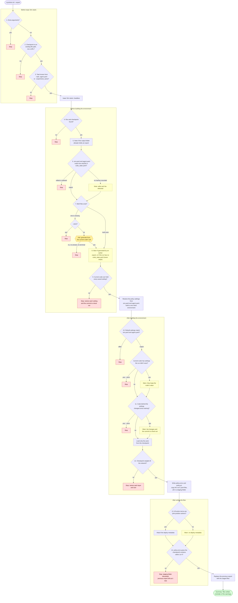

# Exporting policies to ONNX

`./cyclotron.sh --export` turns a training checkpoint into a folder that can be
run in the [policy viewer](view.md), shared on the Hugging
Face Hub with [`--share`](share.md), or deployed on the
robot:

## Quick start

```bash
./cyclotron.sh --export \
    --checkpoint logs/rsl_rl/<experiment_name>/<run>/model_<n>.pt
```

One command is enough for a run trained here: the task is read from the run's
`agent.yaml`. The export lands in `exported/` next to the checkpoint; watch it
with [`--view`](view.md) or publish it with [`--share`](share.md).

## What an export contains

The export is written to `exported/` next to the checkpoint (`--output
<folder>` writes somewhere else):

| File | Contents |
| --- | --- |
| `policy.onnx` | The policy, exported by rsl_rl's own exporter, with the deploy metadata below attached. |
| `policy.pt` | The same policy as TorchScript. |
| `env.yaml`, `agent.yaml` | Unchanged copies of the run's `params/`: the task and training settings. |
| `code_state.yaml` | The code the run was trained with, for runs whose training recorded one. |
| `export.log` | Append-only history of every export written here: which checkpoint, when, and what it printed. |

The ONNX graph is whatever rsl_rl's exporter produces for the actor class: a
plain MLP is `obs -> actions`, an LSTM or GRU carries its state as extra
inputs and outputs. The observation normalizer and the deterministic output
head are baked into the graph.

## What `--export` does

1. **Resolves the checkpoint and task.** A full `--checkpoint` path is enough
   for runs trained here: the task is read from the run's `agent.yaml`.
   Otherwise pass `--task`, and pick the checkpoint like `--play` does
   (`--load_run`, `--experiment_name`, or the latest run by default).
2. **Rebuilds the run's policy settings,** like a restart of the run. It loads
   the task's config, then sets what the policy sees and does back to the
   values in the run's `env.yaml` and `agent.yaml`: the actor's observation
   terms (functions, scales, clipping, history), the actions, the robot's
   default pose and actuators, `sim.dt`, decimation and the actor network (an
   LSTM run exports as an LSTM even if the task now trains an MLP). The two
   files are the only source of these settings; nothing on the command line
   changes them. Everything else (rewards, terrain, events, commands, the
   robot model file) stays as the code has it: it only shapes training, or
   depends on the machine. Then it builds a one-robot environment.
3. **Loads only the actor** from the checkpoint. The critic, the AMP
   discriminator and the optimizer are training-only state, so a run whose
   critic no longer matches the current code still exports.
4. **Exports and bundles.** Writes `policy.onnx` and `policy.pt` with rsl_rl's
   exporter and copies the run's yaml files next to them, in a staging folder
   inside the output folder.
5. **Attaches the deploy metadata** described below to `policy.onnx`.
6. **Checks the export** against the checkpoint, and only then moves the
   files into place, replacing the previous export's.

Every check along the way is listed in the next section, in the order it runs.

## Checks, step by step

Each check either **stops** the export, **asks** in the terminal, **warns**
and carries on, or just **notes** something. `--strict` turns the warnings it
names into stops; [`--share`](share.md) always exports with `--strict`. From
step 5 on, every message is also appended to `export.log` in the output
folder.

The diagram shows the whole flow. Its numbers are the checks below; the
colors are what a failed check does: red stops, amber asks, yellow warns.



### Before Isaac Sim starts

These take a second, so a typo doesn't cost an Isaac Sim launch.

1. **No extra arguments.** Stops on anything `--export` doesn't take,
   including setting overrides such as `env.actions.joint_pos.scale=0.3`: the
   run's `env.yaml` and `agent.yaml` are the only source of its settings.
   `--export takes no setting overrides or other extra arguments (…)`
2. **The checkpoint exists.** Stops on a `--checkpoint` path that isn't a
   file (`Checkpoint not found: …`), a bare filename without `--load_run`
   (`--checkpoint '…' is not a path. …`), or a URL, since the export needs the
   run folder around the checkpoint (`--export needs the run folder around
   the checkpoint …`).
3. **The task is known.** Taken from `--task`; else, with a full `--checkpoint`
   path, from the experiment name in the run's `agent.yaml`; else from
   `--experiment_name`. Stops when none
   names a known task: `Cannot infer the task: …/agent.yaml not found. Pass it
   with --task.`, `Cannot infer the task for experiment '…'. Pass it with
   --task.` or `Pass --task, or a full --checkpoint path …`

### Before building the environment

4. **A run and checkpoint match.** Without a full `--checkpoint` path, Isaac
   Lab looks up `--load_run` (or the latest run) in the experiment folder and
   stops with its own error if there is none, or no checkpoint in it.
5. **What gets overwritten.** Notes it when the output folder already holds
   an export: `Overwriting the run's existing export.`, or `Overwriting an
   export made before model_….pt was written, …` when that export wasn't of
   the run's latest checkpoint.
6. **`env.yaml` and `agent.yaml` are as training wrote them.** Training
   records their sha256 in `code_state.yaml`. Stops if either no longer
   matches, because it was edited by hand or deleted: `…/params/env.yaml
   changed or went missing since training: …`. Runs trained before the hashes
   were recorded get a note instead: `The run records no sha256 of env.yaml
   and agent.yaml …`
7. **`env.yaml` and `agent.yaml` exist.** Asks when one is missing (a run
   trained elsewhere, or a file deleted from a run without recorded hashes):
   `Generate env.yaml from the current code? [y/N]`. Yes writes it into the
   run's `params/` from the current code, with a first line saying it was
   generated, from which commit and when. No, no answer, or no terminal to
   answer in stops: `Stopped: a policy is exported with its env.yaml and
   agent.yaml, and this run has no …`. **`--strict` stops without asking.**
8. **They weren't generated by an earlier export.** Warns when a file starts
   with that generated line: `…/params/env.yaml was written from the code by
   an earlier --export, not by training.` Also with `--strict`: the first line
   of the file records it, and it travels with the policy under `--share`.
   A run without a `code_state.yaml`, generated files or not, also gets a
   warning that it was trained outside cyclotron and nothing can check the
   export against its training code. The exported policy is tagged
   (`trained_outside_cyclotron` in the [deploy metadata](#deploy-metadata)).
9. **The current code can hold every saved setting.** Stops when it can't,
   one line per setting: an observation term, actuator group or config field
   the code no longer has; a function it can't import under the saved name
   (a function that only moved, for example from the old package name
   `isaac_asimov`, is found by its name); a network class it doesn't have; or
   a Python object it won't read back from the yaml. `The current code can't
   rebuild the policy settings this run was trained with:`, then the commit to
   check out.

### After building the environment

10. **The rebuilt settings match the run.** Compares the policy settings of
    the built environment with `env.yaml` and `agent.yaml`. Stops on any
    difference, which means the rebuild went wrong: `The rebuilt policy
    settings don't match the run's env.yaml and agent.yaml:`. Notes `Checked
    the rebuilt policy settings against the run's env.yaml and agent.yaml:
    they match.` otherwise. Warns about settings the current code has but the
    run didn't save (added since training), which keep the code's value: `The
    current code has policy settings the run didn't save; …`. **`--strict`
    stops on those.**
11. **The code behind the settings is unchanged.** Compares the run's
    `code_state.yaml` with the code you have checked out, limited to what can
    change the exported policy: the cyclotron files that define the functions
    and classes the policy settings name (the file a function is defined in,
    not helpers it imports), the robot model, Isaac Lab's commit and the
    `isaacsim`, `isaaclab`, `rsl-rl-lib` and `torch` versions. Runs trained
    before `code_state.yaml` existed are compared with the commits rsl_rl
    logged in their `git/` folder instead, which can only list changed files,
    or say they "can't be listed" when the commit isn't in this clone. Warns
    with each change and the commit to check out for the exact training code:
    `Code behind the policy settings changed since this run was trained:`.
    **`--strict` stops.** Rewards, the training algorithm, configs and docs
    can't change an export and aren't compared; `--play` still lists them (see
    [Code changes since training](../README.md#code-changes-since-training)).
12. **The checkpoint fits the network.** Stops when the actor's weights don't
    fit the network built from the run's settings, naming each layer and
    size, for example when an observation function now returns more values:
    `The checkpoint's policy doesn't fit the network the current code builds:`.

### After writing the files

13. **The deploy metadata can describe the actions.** For a direct-workflow
    environment, or an action term that isn't a joint position action (a
    velocity, effort or relative position action, for example), warns and
    writes `policy.onnx` without metadata rather than a wrong contract:
    `… not attaching deploy metadata.`
14. **`policy.onnx` gives the checkpoint's actions.** Feeds the same 64
    observations (the environment's first one and 63 noisy copies) to the
    checkpoint and to `policy.onnx` as written, through onnxruntime. A
    recurrent policy (LSTM or GRU) runs 3 steps from an empty memory on both
    sides, the file getting zeros as `h_in`/`c_in` and then its own
    `h_out`/`c_out` back, as a robot runtime does, and the memory it returns
    is compared too; one step would not do, since from an empty memory the
    weights that carry memory between steps multiply zeros. The PyTorch side
    runs in full float32, like onnxruntime. Stops when anything differs by
    more than 1e-4, which means a broken export, for example a dropped
    observation normalizer: `policy.onnx gives different actions than the
    checkpoint (…). Nothing was written to <output folder>.` The new files
    are discarded and the previous export, if any, is left as it was. Notes `Checked policy.onnx against the checkpoint (…): max
    difference …` otherwise.

The export ends with a summary: the files written, and a reminder of any
warnings above.

rsl_rl's own exporter checks nothing: it traces the actor once on zero inputs
and writes the file. Every check above, and the deploy metadata, are
cyclotron's; rsl_rl's only safeguard is PyTorch's strict weight loading, which
step 12 turns into a message naming the layers and sizes that don't fit.

## Options

| Flag | Meaning |
| --- | --- |
| `--task` | Task used to build the policy. Inferred from the run's `agent.yaml` when `--checkpoint` is a full path, or from `--experiment_name`. |
| `--checkpoint` | Checkpoint to export: a full path to a `.pt` file, or a filename inside the `--load_run` folder. |
| `--load_run` | Run folder to export from. Defaults to the latest. |
| `--experiment_name` | Experiment folder under `logs/rsl_rl/`. Defaults to the task's. |
| `--output` | Folder to write to. Defaults to `<checkpoint folder>/exported`. |
| `--strict` | Stop instead of asking or warning in [checks](#checks-step-by-step) 7, 10 and 11: a missing `env.yaml`/`agent.yaml`, policy settings the run didn't save, and changes to the code behind the settings. |
| `--device` | Device to run the export on (an AppLauncher flag; the export always runs headless). |

Other than Isaac Lab's AppLauncher flags, nothing else is accepted: setting overrides such as
`env.actions.joint_pos.scale=0.3` are refused, since the run's `env.yaml` and `agent.yaml` are the only source of its
settings.

## Deploy metadata

`policy.onnx` carries a small deployment contract in the ONNX file's
`metadata_props` (string key-value pairs, readable with `onnx` or any
onnxruntime binding's model-metadata API). It exists so a robot runtime can
check its assumptions about the file before driving a robot with it.

It is a handshake, not configuration. The runtime should compare these values
against its own settings and refuse the policy on any mismatch, never
configure itself from them: a wrong or tampered file must not be able to
retune a robot. Torque limits and the actuator model are deliberately absent;
they belong to the runtime's own configuration (and to `env.yaml`). Runtimes
that read no metadata run the file unchanged, since the graph is untouched.

| Key | Value (all stored as strings) | Meaning |
| --- | --- | --- |
| `deploy_metadata_version` | `"1"` | Schema version. Refuse versions you do not know. |
| `obs_dim`, `action_dim` | int | Width of the graph's `obs` input and `actions` output, read from the graph itself. |
| `joint_names` | JSON list of `action_dim` strings | The joint each action drives, in action order. The single most safety-critical check: a joint-order mismatch silently scrambles the robot. |
| `action_scale`, `action_offset` | JSON lists of `action_dim` floats | The affine that turns a raw action into a position target: `target = action * scale + offset`. The offset is the run's default pose (`init_state.joint_pos` in its `env.yaml`) for tasks that use `use_default_offset`, without the per-environment jitter that `randomize_joint_default_pos` adds during training. |
| `raw_action_clip` | JSON: `null`, or a float `c` | The run's `clip_actions`: raw actions are clamped to `[-c, c]` before the affine, as rsl_rl's environment wrapper did in training. `null` when the run didn't clip. |
| `action_clip` | JSON: `null`, or `action_dim` pairs `[low, high]` (`null` for an unclipped side) | Clip applied to the targets after the affine. |
| `joint_stiffness`, `joint_damping` | JSON lists of `action_dim` floats | The PD gains (kp/kd) the targets were trained to be tracked with, from the run's configured actuators (not the simulated values, which randomization events can perturb). |
| `sim_dt`, `decimation`, `policy_rate_hz` | float, int, float | The policy step: it was trained to act every `sim_dt x decimation` seconds. |
| `observation_names` | JSON list of strings | The policy's input terms in order, as named in `env.yaml` (`<group>/<term>` when the actor reads several groups). The per-term recipe stays in `env.yaml`. |
| `trained_outside_cyclotron` | `"true"`, absent otherwise | Set when the run has no `code_state.yaml`, which cyclotron's training always writes: a checkpoint trained outside cyclotron, or a cyclotron run from before training recorded one (the two can't be told apart). Nothing could check the export against the code it was trained with. |
| `trained_commit` | string, absent when unknown | The commit the run was trained with, from `code_state.yaml` (or the run's `git/` records), for traceability. Ends in `-dirty`, as `git describe --dirty` does, when the run had uncommitted changes, so the commit alone isn't its code. |
| `robot_model_name`, `robot_model_repo`, `robot_model_urdf_filepath`, `robot_model_sha256`, `robot_model_commit`, `robot_model_dirty` | strings (`robot_model_dirty` is JSON `true`/`false`); each absent when the run doesn't record it | The robot model the run was trained with, from `code_state.yaml`: the robot's name, from the `name` of the urdf's `<robot>` element (`asimov_1`), the model repository as `<owner>/<name>` of its `origin` remote (`menloresearch/asimov-1`), the urdf's path from that repository's root (`sim-model/urdf/asimov_1.urdf`), the urdf's sha256, the repository's commit, and whether the repository had uncommitted changes at training. Check out the commit and hash the urdf to get the exact model back; with `robot_model_dirty` true, the commit alone isn't it. When git doesn't track the urdf, the path is just its file name and the repository, commit and dirty keys are absent. |

The metadata is resolved from the live environment at export time, so patterns
in the config (joint regexes, per-joint scales) arrive as concrete per-joint
values. It is attached for manager-based tasks whose action terms are joint
position actions; for anything else (direct-workflow envs, velocity, effort or
relative position actions) `--export` prints a warning and writes the file
without metadata rather than writing a wrong contract.

### Inspecting the metadata

Print every key of an exported file with the `onnx` package, which the
cyclotron environment already has:

```bash
python -c '
import json, sys, onnx
model = onnx.load(sys.argv[1], load_external_data=False)
for prop in model.metadata_props:
    try:
        value = json.loads(prop.value)
    except ValueError:
        value = prop.value
    print(f"{prop.key}: {value}")
' logs/rsl_rl/<experiment>/<run>/exported/policy.onnx
```

A file without metadata (e.g. one exported by an older cyclotron, or with a
non-joint action term) prints nothing. On the robot side, onnxruntime reads the
same map without the `onnx` package, which is how a runtime would check it:

```python
import onnxruntime as ort

metadata = ort.InferenceSession("policy.onnx").get_modelmeta().custom_metadata_map
```

[Netron](https://netron.app) also lists the keys under the model's properties
when you open the file.

## Advanced: exporting a model that was not trained with cyclotron

`--export` works for any Isaac Lab run trained with rsl_rl, not only this
repo's tasks. It needs three things:

1. **The run directory layout Isaac Lab writes**: the checkpoint
   (`model_<n>.pt`) with `params/agent.yaml` and `params/env.yaml` next to it
   (Isaac Lab's `train.py` writes these). The policy settings, the yaml
   copies and the code-change check come from there.
2. **The task, passed explicitly**: task inference only knows this repo's
   experiments, so pass the gym id the run was trained with, e.g.

   ```bash
   ./cyclotron.sh --export --task Isaac-Velocity-Rough-Anymal-C-v0 \
       --checkpoint /path/to/run/model_1500.pt
   ```

   Every task that `isaaclab_tasks` registers is available. A task from a
   third-party extension is not: `export.py` only imports `isaaclab_tasks`
   and `cyclotron.tasks`, so a task registered by another package would need
   that package imported (install it and add the import) before `gym.make`
   can find it.
3. **An rsl_rl checkpoint this rsl_rl version can read.** The pinned
   `rsl-rl-lib` (see `source/cyclotron/setup.py`) loads its own layout
   (`actor_state_dict` etc.); checkpoints from recent earlier versions are
   converted on the fly by Isaac Lab's compatibility shim. If loading fails
   with a layout error, re-export from the rsl_rl version that trained it.

**Export from the same codebase, and the same commit, the run was trained
with, as far as possible.** The export builds the environment from this
checkout's code, and for a foreign run nothing records what the training code
was, so nothing can tell you when the two differ. If the run has no
`env.yaml` or `agent.yaml`, `--export` offers to write them from the current
code, which is only right when the current code is the training code.
Every such export warns about it, and the ONNX deploy metadata carries
`trained_outside_cyclotron`.

What to expect with a foreign run:

- The code-change check cannot find `params/code_state.yaml` and falls back
  to the `git/*.diff` records rsl_rl wrote. Commits from another repository
  are not in this clone, so it reports that changes "can't be listed" — a
  warning, and the export proceeds (`--strict` would stop on it).
- The policy settings are rebuilt from the run's `env.yaml` and `agent.yaml`
  as for local runs. A function the run used from a package that isn't
  installed here, and that this checkout has under no other module, stops the
  export.
- The deploy metadata is attached as long as the task is manager-based with
  joint position actions, Anymal and friends included; `trained_commit` is only
  present when the run recorded a single commit.
- The export check (ONNX vs checkpoint) runs the same way as for local runs.
- [`--view`](view.md) is Asimov-specific: the viewer
  simulates the Asimov 1 robot, so a policy for another robot exports fine
  but cannot be watched there. Use the robot's own tooling, or Isaac Lab's
  `play.py`, to see it move.
