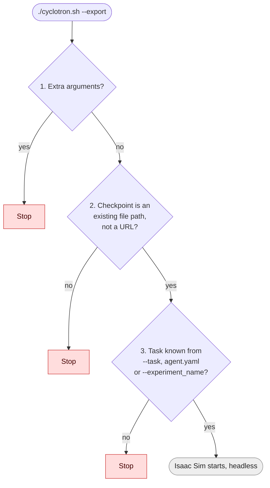
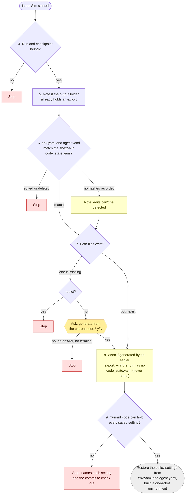
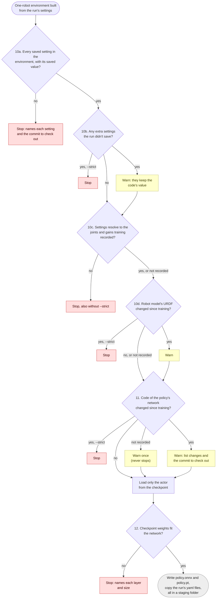
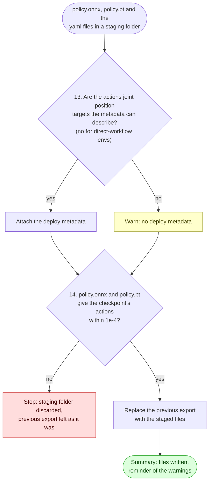

# Exporting policies to ONNX

`./cyclotron.sh --export` turns a training checkpoint into a folder that can be
run in the [policy viewer](view.md), shared on the Hugging
Face Hub with [`--share`](share.md), or deployed on the
robot:

## Quick start

```bash
./cyclotron.sh --export \
    --checkpoint logs/rsl_rl/<experiment_name>/<run>/model_<n>.pt
```

One command is enough for a run trained here: the task is read from the run's
`agent.yaml`. The export lands in `exported/` next to the checkpoint; watch it
with [`--view`](view.md) or publish it with [`--share`](share.md).

## What an export contains

The export is written to `exported/` next to the checkpoint (`--output
<folder>` writes somewhere else):

| File | Contents |
| --- | --- |
| `policy.onnx` | The policy, exported by rsl_rl's own exporter, with the deploy metadata below attached. |
| `policy.pt` | The same policy as TorchScript. |
| `env.yaml`, `agent.yaml` | Unchanged copies of the run's `params/`: the task and training settings. |
| `code_state.yaml` | The code the run was trained with, for runs whose training recorded one. |
| `export.log` | Append-only history of every export written here: which checkpoint, when, and what it printed. |

The ONNX graph is whatever rsl_rl's exporter produces for the actor class: a
plain MLP is `obs -> actions`, an LSTM or GRU carries its state as extra
inputs and outputs. The observation normalizer and the deterministic output
head are baked into the graph.

## What `--export` does

1. **Resolves the checkpoint and task.** A full `--checkpoint` path is enough
   for runs trained here: the task is read from the run's `agent.yaml`.
   Otherwise pass `--task`, and pick the checkpoint like `--play` does
   (`--load_run`, `--experiment_name`, or the latest run by default).
2. **Rebuilds the run's policy settings,** like a restart of the run. It loads
   the task's config, then sets what the policy sees and does back to the
   values in the run's `env.yaml` and `agent.yaml`: the actor's observation
   terms (functions, scales, clipping, history), the actions, the robot's
   default pose and actuators, `sim.dt`, decimation and the actor network (an
   LSTM run exports as an LSTM even if the task now trains an MLP). The two
   files are the only source of these settings; nothing on the command line
   changes them. Everything else (rewards, terrain, events, commands, the
   robot model file) stays as the code has it: it only shapes training, or
   depends on the machine. Then it builds a one-robot environment.
3. **Loads only the actor** from the checkpoint. The critic, the AMP
   discriminator and the optimizer are training-only state, so a run whose
   critic no longer matches the current code still exports.
4. **Exports and bundles.** Writes `policy.onnx` and `policy.pt` with rsl_rl's
   exporter and copies the run's yaml files next to them, in a staging folder
   inside the output folder.
5. **Attaches the deploy metadata** described below to `policy.onnx`.
6. **Checks the export** against the checkpoint, and only then moves the
   files into place, replacing the previous export's. A bundle file the
   previous export had and this one doesn't (a `code_state.yaml` from a run
   that had one) is removed; `export.log` and files of your own are kept.

Every check along the way is listed in the next section, in the order it runs.

## Checks, step by step

Each check either **stops** the export, **asks** in the terminal, **warns**
and carries on, or just **notes** something. `--strict` turns the warnings it
names into stops; [`--share`](share.md) always exports with `--strict`. From
step 5 on, every message is also appended to `export.log` in the output
folder.

The export runs in four stages, each with its own checks. Any check that
stops ends the export there; the previous export stays as it was until the
last stage has passed.

```mermaid
flowchart LR
    classDef done fill:#dfd,stroke:#3a3,color:#040
    classDef step fill:#eee,stroke:#999,color:#222
    classDef stage fill:#e8f0fe,stroke:#4a6fa5,color:#123

    Start(["./cyclotron.sh<br/>--export"]) --> S1["<b>Before Isaac<br/>Sim starts</b><br/>Checks 1–3:<br/>is the command<br/>valid?"]
    S1 --> Launch["Isaac Sim<br/>starts,<br/>headless"]
    Launch --> S2["<b>Before building<br/>the environment</b><br/>Checks 4–9:<br/>are the run's saved<br/>settings intact<br/>and usable?"]
    S2 --> Env["Restore the<br/>policy settings,<br/>build a one-robot<br/>environment"]
    Env --> S3["<b>After building<br/>the environment</b><br/>Checks 10–12:<br/>will the run's weights<br/>drive the policy it<br/>was trained with?"]
    S3 --> Write["Write policy.onnx,<br/>policy.pt and the<br/>yaml files into<br/>a staging folder"]
    Write --> S4["<b>After writing<br/>the files</b><br/>Checks 13–14:<br/>is policy.onnx<br/>faithful and<br/>deployable?"]
    S4 --> Replace["Replace the<br/>previous export<br/>with the staged<br/>files"]
    Replace --> Done(["Summary: files<br/>written, reminder<br/>of the warnings"])

    class S1,S2,S3,S4 stage
    class Launch,Env,Write,Replace step
    class Done done
```



Each stage's section below starts with a diagram of its checks:
[Before Isaac Sim starts](#before-isaac-sim-starts),
[Before building the environment](#before-building-the-environment),
[After building the environment](#after-building-the-environment) and
[After writing the files](#after-writing-the-files). Their numbers are the
checks listed under them; the colors are what a failed check does: red stops,
amber asks, yellow warns.

### Before Isaac Sim starts

These take a second, so a typo doesn't cost an Isaac Sim launch.



1. **No extra arguments.** Stops on anything `--export` doesn't take,
   including setting overrides such as `env.actions.joint_pos.scale=0.3`: the
   run's `env.yaml` and `agent.yaml` are the only source of its settings.
   `--export takes no setting overrides or other extra arguments (…)`
2. **The checkpoint exists.** Stops on a `--checkpoint` path that isn't a
   file (`Checkpoint not found: …`), a bare filename without `--load_run`
   (`--checkpoint '…' is not a path. …`), or a URL, since the export needs the
   run folder around the checkpoint (`--export needs the run folder around
   the checkpoint …`).
3. **The task is known.** Taken from `--task`; else, with a full `--checkpoint`
   path, from the experiment name in the run's `agent.yaml`; else from
   `--experiment_name`. Stops when none
   names a known task: `Cannot infer the task: …/agent.yaml not found. Pass it
   with --task.`, `Cannot infer the task for experiment '…'. Pass it with
   --task.` or `Pass --task, or a full --checkpoint path …`

### Before building the environment



4. **A run and checkpoint match.** Without a full `--checkpoint` path, Isaac
   Lab looks up `--load_run` (or the latest run) in the experiment folder and
   stops with its own error if there is none, or no checkpoint in it.
5. **What gets overwritten.** Notes it when the output folder already holds
   an export: `Overwriting the run's existing export.`, or `Overwriting an
   export made before model_….pt was written, …` when the run wrote a
   checkpoint after that export (an export made while it was still training).
   The note goes by file times, so exporting an older checkpoint after
   training ended gets the first note; `export.log` records which checkpoint
   each export was of.
6. **`env.yaml` and `agent.yaml` are as training wrote them.** Training
   records their sha256 in `code_state.yaml`. Stops if either no longer
   matches, because it was edited by hand or deleted: `…/params/env.yaml
   changed or went missing since training: …`. Runs trained before the hashes
   were recorded get a note instead: `The run records no sha256 of env.yaml
   and agent.yaml …`
7. **`env.yaml` and `agent.yaml` exist.** Asks when one is missing (a run
   trained elsewhere, or a file deleted from a run without recorded hashes):
   `Generate env.yaml from the current code? [y/N]`. Yes generates it from the
   current code, with a first line saying it was generated, from which commit
   and when, and writes it into the run's `params/` once the export succeeds
   (a stopped export leaves the run as it was). No, no answer, or no terminal
   to answer in stops: `Stopped: a policy is exported with its env.yaml and
   agent.yaml, and this run has no …`. **`--strict` stops without asking.**
8. **They weren't generated by an earlier export.** Warns when a file starts
   with that generated line: `…/params/env.yaml was written from the code by
   an earlier --export, not by training.` Also with `--strict`: the first line
   of the file records it, and it travels with the policy under `--share`.
   A run without a `code_state.yaml`, generated files or not, also gets a
   warning that it has none (it was trained outside cyclotron, or before
   cyclotron recorded one) and nothing can check the export against its
   training code. The exported policy is tagged
   (`code_state_missing` in the [deploy metadata](#deploy-metadata)).
9. **The current code can hold every saved setting.** Stops when it can't,
   one line per setting: an observation term, actuator group or config field
   the code no longer has; a function it can't import under the saved name
   (a function that only moved, for example from the old package name
   `isaac_asimov`, is found by its name); a network class it doesn't have; or
   a Python object it won't read back from the yaml. `The current code can't
   rebuild the policy settings this run was trained with:`, then the commit to
   check out.

### After building the environment



10. **The built environment is the one the run was trained in.** The policy
    settings of the built environment are compared with `env.yaml` and
    `agent.yaml` in two directions (10a, 10b), then what they resolve to on the
    robot model with what training recorded (10c, 10d):
    - **10a. Every saved setting is in the environment, with its saved
      value.** Stops on any difference: `The rebuilt policy settings don't
      match the run's env.yaml and agent.yaml:`, one line per setting. A
      difference means the current code changes a saved setting while it
      builds the environment (a config that computes a value from others, for
      example), so the policy would see something other than what it was
      trained with. To fix it, check out the commit the message names, the one
      the run was trained with, and export from there, or train a new run with
      the current code. Notes `Checked the rebuilt policy settings against the
      run's env.yaml and agent.yaml: they match.` otherwise.
    - **10b. The environment has no settings the run didn't save.** 10a can
      only check settings the yaml contains. A setting added to the code after
      training has no line in the yaml, so it can't be matched and takes the
      current code's value, which may not be what the run was trained with.
      Warns with each one: `The current code has policy settings the run
      didn't save; …`. **`--strict` stops on those.** To fix it, check out the
      commit the run was trained with, or confirm the new settings' values
      reproduce the old behaviour and export without `--strict`.
    - **10c. The settings resolve to the joints and gains training
      recorded.** The settings name joints by pattern (`.*_knee`); the robot
      model decides which joints they match, in which order, and with which
      stiffness and damping. Training records what they resolved to in
      `code_state.yaml` (`policy_io`): each action joint in action order with
      its scale, offset, clip, stiffness and damping, and the joints or bodies
      each of the policy's observation terms reads, in order. Export resolves
      the same from the environment it built and compares. **Stops on any
      difference, also without `--strict`**: `The joints and gains the policy's
      inputs and outputs resolve to changed since training:`, one line per
      joint (`action joint 4: left_knee -> left_hip_pitch`, `stiffness
      right_ankle: 40 -> 35`). The settings match the run's, so a difference
      means the robot model the current code loads resolves them differently,
      and the policy would drive the wrong joints or gains. The later checks
      can't see it: the checkpoint and `policy.onnx` both run in this same
      environment. To fix it, load the robot model the run was trained with,
      or check out the commit the message names. Notes `Checked the joints and
      gains the policy resolves to against the run's: they match.` otherwise.
      Runs trained before this was recorded skip it.
    - **10d. The robot model is the one the run was trained with.** Training
      records the sha256 of the robot's URDF (`robot_model` in
      `code_state.yaml`). Export hashes the URDF the current config loads and
      warns when it differs, naming both files and their commits: `The robot
      model changed since training: …`. When 10c passed, the policy still
      reaches the same joints with the same gains, but the simulated robot (its
      masses, limits or geometry) isn't the one it was trained on. **`--strict`
      stops.** Can't be checked when the run recorded no sha256 or the current
      robot model isn't a local file; a run that records neither its robot
      model nor its joints and gains gets a note saying so. The result goes
      into the deploy metadata as `robot_model_check`.
11. **The code of the policy's network is unchanged.** Training records the
    sha256 of the code behind the actor in `code_state.yaml` (`actor_code`):
    every module of rsl_rl's `models` and `modules` packages (the network
    classes, the MLP, the normalizer, the memory module, the action
    distributions), and, for a network class defined outside rsl_rl, the
    module of that class and of each class it inherits from. Export hashes the
    same modules in the code you have installed and compares. This is the one
    thing the later checks can't see: the weights load and the ONNX file
    agrees with the PyTorch policy, because both are built by the same
    changed code. Warns with each module that differs and the commit to check
    out for the exact training code: `The code of the policy's network changed
    since this run was trained:`. **`--strict` stops.** Nothing else is
    compared: not the rest of rsl_rl (the training algorithm, runners,
    utilities), not this package's files, Isaac Lab or the library versions,
    so updating them doesn't block an export.
    A run that recorded no network code (trained before it was recorded, or
    outside cyclotron) can't be checked: one warning, never a stop, also with
    `--strict`. The result goes into the deploy metadata as `actor_code`.
12. **The checkpoint fits the network.** Stops when the actor's weights don't
    fit the network built from the run's settings, naming each layer and
    size, for example when an observation function now returns more values:
    `The checkpoint's policy doesn't fit the network the current code builds:`.

### After writing the files



13. **The deploy metadata can describe the actions.** For a direct-workflow
    environment, or an action term that isn't a joint position action (a
    velocity, effort or relative position action, for example), warns and
    writes `policy.onnx` without metadata rather than a wrong contract:
    `… not attaching deploy metadata.`
14. **`policy.onnx` and `policy.pt` give the checkpoint's actions.** rsl_rl
    writes each file with its own exporter, so one being right says nothing
    about the other, and both are checked. Feeds the same 64 observations (the
    environment's first one and 63 copies with noise on the scale of each
    entry) to the checkpoint, to
    `policy.onnx` as written, through onnxruntime, and to `policy.pt` as
    written, through TorchScript. A recurrent policy (LSTM or GRU) runs 3
    steps from an empty memory on every side, as a robot runtime does:
    `policy.onnx` gets zeros as `h_in`/`c_in` and then its own `h_out`/`c_out`
    back, and `policy.pt`, which keeps its memory inside, starts from a
    `reset()`. The memory each returns or keeps is compared too; one step
    would not do, since from an empty memory the weights that carry memory
    between steps multiply zeros. The PyTorch side runs in full float32, like
    onnxruntime. Stops when anything differs by more than 1e-4 (relative to the
    value where it is above 1, as float32 rounding grows with it), which means a
    broken export, for example a dropped observation normalizer:
    `policy.onnx gives different actions than the checkpoint (…).` (or
    `policy.pt …`), then `Nothing was written to <output folder>.` The new
    files are discarded and the previous export, if any, is left as it was.
    Notes `Checked policy.onnx against the checkpoint (…): max difference …`
    and the same for `policy.pt` otherwise.

The export ends with a summary: the files written, and a reminder of any
warnings above.

rsl_rl's own exporter checks nothing: it traces the actor once on zero inputs
and writes the file. Every check above, and the deploy metadata, are
cyclotron's; rsl_rl's only safeguard is PyTorch's strict weight loading, which
step 12 turns into a message naming the layers and sizes that don't fit.

### Examples, check by check

What each check catches, as a story: how the run was trained, what changed
afterwards, and what the export does about it. The field and function names
are made up.

**6. The yaml changed since training.**

- After training, you edit the run's `env.yaml` by hand to try a smaller
  action scale.
- You export. The file's sha256 no longer matches what training recorded in
  `code_state.yaml`, so the export stops. The yaml is the only record of the
  training settings, so an edited one can't be trusted.

**7. The yaml is missing.**

- You copy a run from another machine, but only `model_2000.pt` and
  `params/agent.yaml`.
- You export. With no `env.yaml` the training settings are unknown, so the
  export asks whether to generate one from the current code; only you can
  tell whether that's what the run used. `--strict` stops without asking, and
  `--share` refuses the run before exporting.

**9. A saved setting the code can't hold.**

- The run's `env.yaml` has an observation term `feet_contact` that calls
  `mdp.feet_contact_state`.
- Later someone deletes that function, or the term.
- You export. There is nowhere to put the setting, so the export stops before
  building the environment. Had the function only moved, for example from
  `isaac_asimov` to `cyclotron`, it would be found in its new module and the
  export would go on.

**10a. A saved setting the build changes.**

- The run saved `decimation: 4`, a 50 Hz policy.
- Later someone changes the config to work `decimation` out from the
  simulation timestep while the environment is built.
- You export. The rebuild sets `decimation: 4` from the yaml, then the new
  code replaces it with 5. The export stops on `decimation`, saved 4 and
  built 5. Without the stop, the policy would run at 40 Hz instead of the
  50 Hz it was trained at.

**10b. A setting the run didn't save.**

- You train a run today, its `joint_pos` observation giving the raw joint
  positions.
- Next week someone adds an `offset` field to that observation term, with a
  default of the robot's standing pose, so joint positions are now measured
  from that pose.
- You export the old run. Every key in its yaml matches, so 10a passes. The
  observation is the same size, so 12 passes. `policy.onnx` agrees with the
  checkpoint, so 14 passes.
- But the policy now sees joint positions shifted by the standing pose, which
  it never saw in training, and the yaml can't say otherwise because the
  field didn't exist then. Only 10b flags it, naming `offset` and its value.
- A new setting that changes a size as well, say a `history_length` of 3 that
  stacks 3 frames of joint velocity, is also stopped by 12. 10b is what
  catches the ones that only change values.

**10c. The same settings reach other joints.**

- A task names its action joints by pattern, `.*_hip_.*` then `.*_knee`, and
  the run is trained on a robot model listing the left leg's joints first.
- Later the robot model is regenerated and lists the right leg first.
- You export. The yaml matches, since the patterns are the same. The weights
  load, since there are as many joints. `policy.onnx` agrees with the
  checkpoint, since both run in the same environment.
- But the policy's first action now goes to the right hip, not the left one.
  Only 10c notices, naming each action joint whose place changed, and stops,
  also without `--strict`. A changed actuator stiffness or damping on the
  robot is stopped the same way.

**10d. The robot model changed, the joints didn't.**

- Later someone corrects the shank masses in the robot's URDF.
- You export. The joints and gains are the same, so 10c passes, but the
  robot the policy was trained on isn't the one simulated now. 10d warns,
  naming both URDFs and their commits, and `--strict` stops.

**11. The code of the policy's network changed.**

- The run was trained with rsl_rl's MLP using ELU activations.
- Later someone edits the MLP class to use SiLU.
- You export. The yaml matches and the weights load, since the layer sizes
  are the same. `policy.onnx` agrees with the PyTorch policy, since both use
  SiLU now.
- But the network computes something other than what it was trained to.
  Only 11's code hashes notice.

**12. The checkpoint doesn't fit the network.**

- The run observes its feet with a function that returns a contact flag per
  foot, 2 values.
- Later someone changes that function to return each foot's contact force
  too, 4 values, under the same name.
- You export. The yaml matches and the joints are the same. The network built
  from the yaml expects a wider input than the checkpoint's first layer has,
  so the export stops, naming the layer and both sizes.

**13. The metadata can't describe the actions.**

- You build a new task whose actions are joint velocities.
- You export. The deploy metadata only describes actions that are joint
  position targets, so the export warns and writes `policy.onnx` without
  metadata rather than a wrong contract.

**14. `policy.onnx` or `policy.pt` doesn't give the checkpoint's actions.**

- A change to the exporter leaves the observation normalizer out of the ONNX
  graph.
- You export. On the same 64 observations, `policy.onnx` and the checkpoint
  give different actions, so the export stops and discards the new files,
  `policy.pt` included. A bug in the TorchScript exporter stops it the same
  way.
  This one is always an exporter bug, not a problem with the run.

In short: 6 to 9 catch problems with the run's files, 10 to 12 code that
changed since training, and 13 and 14 problems with the exported file. 10b,
10c, 10d and 11 catch changes nothing later would notice. 10c always stops,
since a policy driving the wrong joints is never what you want; `--strict`
stops on the others.

## Options

| Flag | Meaning |
| --- | --- |
| `--task` | Task used to build the policy. Inferred from the run's `agent.yaml` when `--checkpoint` is a full path, or from `--experiment_name`. |
| `--checkpoint` | Checkpoint to export: a full path to a `.pt` file, or a filename inside the `--load_run` folder. |
| `--load_run` | Run folder to export from. Defaults to the latest. |
| `--experiment_name` | Experiment folder under `logs/rsl_rl/`. Defaults to the task's. |
| `--output` | Folder to write to. Defaults to `<checkpoint folder>/exported`. |
| `--strict` | Stop instead of asking or warning in [checks](#checks-step-by-step) 7, 10b, 10d and 11: a missing `env.yaml`/`agent.yaml`, policy settings the run didn't save, a changed robot model, and changes to the code of the policy's network. Check 10c, the joints and gains the policy resolves to, stops also without it. |
| `--device` | Device to run the export on (an AppLauncher flag; the export always runs headless). |

Other than Isaac Lab's AppLauncher flags, nothing else is accepted: setting overrides such as
`env.actions.joint_pos.scale=0.3` are refused, since the run's `env.yaml` and `agent.yaml` are the only source of its
settings.

## Deploy metadata

`policy.onnx` carries a small deployment contract in the ONNX file's
`metadata_props` (string key-value pairs, readable with `onnx` or any
onnxruntime binding's model-metadata API). It exists so a robot runtime can
check its assumptions about the file before driving a robot with it.

It is a handshake, not configuration. The runtime should compare these values
against its own settings and refuse the policy on any mismatch, never
configure itself from them: a wrong or tampered file must not be able to
retune a robot. Torque limits and the actuator model are deliberately absent;
they belong to the runtime's own configuration (and to `env.yaml`). Runtimes
that read no metadata run the file unchanged, since the graph is untouched.

| Key | Value (all stored as strings) | Meaning |
| --- | --- | --- |
| `deploy_metadata_version` | `"1"` | Schema version. Refuse versions you do not know. |
| `obs_dim`, `action_dim` | int | Width of the graph's `obs` input and `actions` output, read from the graph itself. |
| `joint_names` | JSON list of `action_dim` strings | The joint each action drives, in action order. The single most safety-critical check: a joint-order mismatch silently scrambles the robot. |
| `action_scale`, `action_offset` | JSON lists of `action_dim` floats | The affine that turns a raw action into a position target: `target = action * scale + offset`. The offset is the run's default pose (`init_state.joint_pos` in its `env.yaml`) for tasks that use `use_default_offset`, without the per-environment jitter that `randomize_joint_default_pos` adds during training. |
| `raw_action_clip` | JSON: `null`, or a float `c` | The run's `clip_actions`: raw actions are clamped to `[-c, c]` before the affine, as rsl_rl's environment wrapper did in training. `null` when the run didn't clip. |
| `action_clip` | JSON: `null`, or `action_dim` pairs `[low, high]` (`null` for an unclipped side) | Clip applied to the targets after the affine. |
| `joint_stiffness`, `joint_damping` | JSON lists of `action_dim` floats | The PD gains (kp/kd) the targets were trained to be tracked with, from the run's configured actuators (not the simulated values, which randomization events can perturb). |
| `sim_dt`, `decimation`, `policy_rate_hz` | float, int, float | The policy step: it was trained to act every `sim_dt x decimation` seconds. |
| `observation_names` | JSON list of strings | The policy's input terms in order, as named in `env.yaml` (`<group>/<term>` when the actor reads several groups). The per-term recipe stays in `env.yaml`. |
| `code_state_missing` | `"true"`, absent otherwise | Set when the run has no `code_state.yaml`, which cyclotron's training always writes: a checkpoint trained outside cyclotron, or a cyclotron run from before training recorded one (the two can't be told apart). Nothing could check the export against the code it was trained with. |
| `actor_code` | `"unchanged"`, `"changed"`, `"unrecorded"` | Whether the code of the policy's network matched what `code_state.yaml` recorded at training (check 11). `"unrecorded"`: the run recorded none, so it couldn't be checked. `"changed"` only appears in a file from a plain `--export`, since `--strict` (and so `--share`) stops on it. |
| `robot_model_check` | `"matched"`, `"changed"`, `"unchecked"` | Whether the URDF the export loaded has the sha256 `code_state.yaml` recorded at training (check 10d). `"unchecked"`: the run recorded no sha256, or the current robot model isn't a local file. `"changed"` only appears in a file from a plain `--export`, since `--strict` stops on it; the joints and gains above still matched the run's, since check 10c stops otherwise. |
| `trained_commit` | string, absent when unknown | The commit the run was trained with, from `code_state.yaml` (or the run's `git/` records), for traceability. Ends in `-dirty`, as `git describe --dirty` does, when the run had uncommitted changes, so the commit alone isn't its code, and also when the run didn't record whether it had any. |
| `robot_model_name`, `robot_model_repo`, `robot_model_urdf_filepath`, `robot_model_sha256`, `robot_model_commit`, `robot_model_dirty` | strings (`robot_model_dirty` is JSON `true`/`false`); each absent when the run doesn't record it | The robot model the run was trained with, from `code_state.yaml`: the robot's name, from the `name` of the urdf's `<robot>` element (`asimov_1`), the model repository as `<owner>/<name>` of its `origin` remote (`menloresearch/asimov-1`), the urdf's path from that repository's root (`sim-model/urdf/asimov_1.urdf`), the urdf's sha256, the repository's commit, and whether the repository had uncommitted changes at training. Check out the commit and hash the urdf to get the exact model back; with `robot_model_dirty` true, the commit alone isn't it. When git doesn't track the urdf, the path is just its file name and the repository, commit and dirty keys are absent. |

The metadata is resolved from the live environment at export time, so patterns
in the config (joint regexes, per-joint scales) arrive as concrete per-joint
values. It is attached for manager-based tasks whose action terms are joint
position actions; for anything else (direct-workflow envs, velocity, effort or
relative position actions) `--export` prints a warning and writes the file
without metadata rather than writing a wrong contract. For runs that recorded
what the patterns resolved to at training, check 10c has already stopped the
export if the joints, scales, offsets, clips or gains changed since.

### Inspecting the metadata

Print every key of an exported file with the `onnx` package, which the
cyclotron environment already has:

```bash
python -c '
import json, sys, onnx
model = onnx.load(sys.argv[1], load_external_data=False)
for prop in model.metadata_props:
    try:
        value = json.loads(prop.value)
    except ValueError:
        value = prop.value
    print(f"{prop.key}: {value}")
' logs/rsl_rl/<experiment>/<run>/exported/policy.onnx
```

A file without metadata (e.g. one exported by an older cyclotron, or with a
non-joint action term) prints nothing. On the robot side, onnxruntime reads the
same map without the `onnx` package, which is how a runtime would check it:

```python
import onnxruntime as ort

metadata = ort.InferenceSession("policy.onnx").get_modelmeta().custom_metadata_map
```

[Netron](https://netron.app) also lists the keys under the model's properties
when you open the file.

## Advanced: exporting a model that was not trained with cyclotron

`--export` works for any Isaac Lab run trained with rsl_rl, not only this
repo's tasks. It needs three things:

1. **The run directory layout Isaac Lab writes**: the checkpoint
   (`model_<n>.pt`) with `params/agent.yaml` and `params/env.yaml` next to it
   (Isaac Lab's `train.py` writes these). The policy settings, the yaml
   copies and the code-change check come from there.
2. **The task, passed explicitly**: task inference only knows this repo's
   experiments, so pass the gym id the run was trained with, e.g.

   ```bash
   ./cyclotron.sh --export --task Isaac-Velocity-Rough-Anymal-C-v0 \
       --checkpoint /path/to/run/model_1500.pt
   ```

   Every task that `isaaclab_tasks` registers is available. A task from a
   third-party extension is not: `export.py` only imports `isaaclab_tasks`
   and `cyclotron.tasks`, so a task registered by another package would need
   that package imported (install it and add the import) before `gym.make`
   can find it.
3. **An rsl_rl checkpoint this rsl_rl version can read.** The pinned
   `rsl-rl-lib` (see `source/cyclotron/setup.py`) loads its own layout
   (`actor_state_dict` etc.); checkpoints from recent earlier versions are
   converted on the fly by Isaac Lab's compatibility shim. If loading fails
   with a layout error, re-export from the rsl_rl version that trained it.

**Export from the same codebase, and the same commit, the run was trained
with, as far as possible.** The export builds the environment from this
checkout's code, and for a foreign run nothing records what the training code
was, so nothing can tell you when the two differ. If the run has no
`env.yaml` or `agent.yaml`, `--export` offers to write them from the current
code, which is only right when the current code is the training code.
Every such export warns about it, and the ONNX deploy metadata carries
`code_state_missing`.

What to expect with a foreign run:

- The network-code check finds no `params/code_state.yaml`, so it can't
  compare anything: the run is reported as trained outside cyclotron, the
  metadata says `actor_code: unrecorded`, and the export proceeds, also with
  `--strict` and `--share`.
- The policy settings are rebuilt from the run's `env.yaml` and `agent.yaml`
  as for local runs. A function the run used from a package that isn't
  installed here, and that this checkout has under no other module, stops the
  export.
- The deploy metadata is attached as long as the task is manager-based with
  joint position actions, Anymal and friends included; `trained_commit` is only
  present when the run recorded a single commit.
- The export check (ONNX vs checkpoint) runs the same way as for local runs.
- [`--view`](view.md) is Asimov-specific: the viewer
  simulates the Asimov 1 robot, so a policy for another robot exports fine
  but cannot be watched there. Use the robot's own tooling, or Isaac Lab's
  `play.py`, to see it move.
