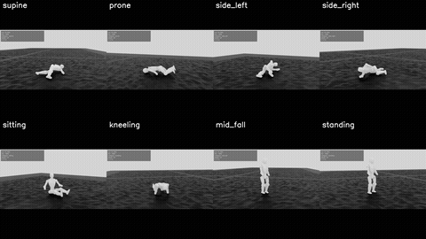
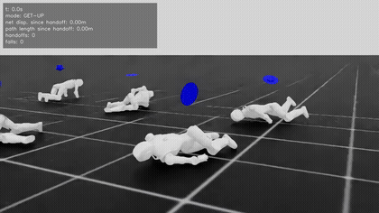

# Asimov 1 Get-Up Policy

## What it is

Asimov 1 can get back up on its own after a fall — from its back, front, side,
sitting, kneeling, or mid-fall — in about 3 seconds. Once it's back on its
feet, control hands off to the walking policy so it can keep moving.

## Showcase

**Getting up from all 8 starting positions (rough ground)**



<video src="media/getup_all_positions.mp4" controls width="600"></video>

[Flat-ground version](media/getup_flat_ground.mp4)

**Get up, hand off to the walking policy, walk away**



<video src="media/getup_then_walk.mp4" controls width="600"></video>

**Checked in a second, independent physics engine (MuJoCo) — the policy was never trained there**

<video src="media/getup_mujoco.mp4" controls width="600"></video>

## Results

All numbers below are from simulation. **The robot has not been tested on real hardware yet.**

| Test | Result |
| --- | --- |
| Get up from all 8 starting positions (normal conditions) | 100% |
| Get up **and** walk 5 m | 32 / 32 |
| Under harder conditions (10% weaker motors, randomized physics, rough ground) — stands and holds | ~88% |
| Under harder conditions, with random pushes — back on its feet within 6 seconds | ~84% |
| Checked in a second physics engine (MuJoCo), never trained there | ~97% |
| Typical time to stand back up | ~3 seconds |

## How it works

The get-up policy is trained entirely in simulation with reinforcement
learning: the robot tries millions of movements and gradually learns which
ones get it back on its feet, guided by a reward signal.

- Starts training from thousands of different fallen poses, so it learns to recover from almost any position, not just a few scripted ones.
- Early on, a temporary helper force makes it easier to push up off the ground — this fades away as the policy improves, so the final skill doesn't depend on it.
- Later training adds weaker motors, rough or uneven ground, and random pushes, so the policy stays robust outside of ideal conditions.
- Rewards favor smooth, gentle motion over jerky or abrupt movements.
- Rewards also discourage straining the arm motors, so the robot doesn't lean on its arms more than it needs to while standing up.

## Try it

**1. Build the fallen-pose cache** (the starting states used during training; the policies here used ~120k states):

```bash
python scripts/getup/build_fallen_cache.py --headless \
    --num_envs 1024 --target_states 120000 --max_minutes 90 --out ~/getup_cache/fallen_v1.pt
```

Training reads `~/getup_cache/fallen_v1.pt` by default; set `ASIMOV_GETUP_CACHE=<path>` to use another file.

**2. Train the base policy**

```bash
./isaac_asimov.sh --train \
    --task Asimov1-GetUp-v0 --num_envs 4096 --headless
```

**3. Fine-tune it in stages** (each stage warm-starts from the previous checkpoint):

```bash
# Build a warm-start checkpoint from the previous stage's model
python source/isaac_asimov/isaac_asimov/tasks/getup/agents/warm_start.py \
    --src <previous-run-dir>/model_<N>.pt --run_dir warmstart_<name>

# Resume training into the next stage from that warm-start
./isaac_asimov.sh --train \
    --task Asimov1-GetUp-StageB-v0 --num_envs 4096 --headless \
    --resume --load_run warmstart_<name> --checkpoint model_warmstart.pt
```

Repeat the same two steps for `Asimov1-GetUp-StageB2-v0` and
`Asimov1-GetUp-StageB2R-v0`, each warm-started from the checkpoint the
previous stage produced.

**Evaluate a checkpoint:**

```bash
python scripts/getup/evaluate.py \
    --task Asimov1-GetUp-StageB2R-Play-v0 --checkpoint <run>/model_<N>.pt \
    --num_episodes 50 --output_dir <output-dir> --headless --enable_cameras
```

**Record per-position videos:**

```bash
python scripts/getup/record_videos.py \
    --task Asimov1-GetUp-Play-v0 --checkpoint <run>/model_<N>.pt \
    --categories supine,prone,mid_fall --output_dir <output-dir> \
    --headless --enable_cameras
```

**Run the get-up + walk demo:**

```bash
python scripts/getup/play_combined.py \
    --getup_checkpoint <getup-run>/model_<N>.pt --walk_checkpoint <walk-run>/model_<N>.pt \
    --num_envs 4 --video --headless --enable_cameras
```

**Export to ONNX** (for firmware / deployment):

```bash
python scripts/getup/export_onnx.py \
    --task Asimov1-GetUp-Play-v0 --checkpoint <run>/model_<N>.pt --headless
```

**Check it in MuJoCo** (the second physics engine):

```bash
python -m scripts.getup.sim2sim.run_sim2sim \
    --mjcf <path-to-asimov_1.xml> --mode getup --onnx <run>/exported/policy.onnx \
    --categories supine,prone,side_left,side_right,sitting,kneeling,mid_fall,standing
```

## Safety note

This policy has only been tested in simulation — real-robot behavior is
unverified. If you try it on hardware, start on a harness or gantry, with
reduced motor limits, and follow the team's hardware safety guidance.
